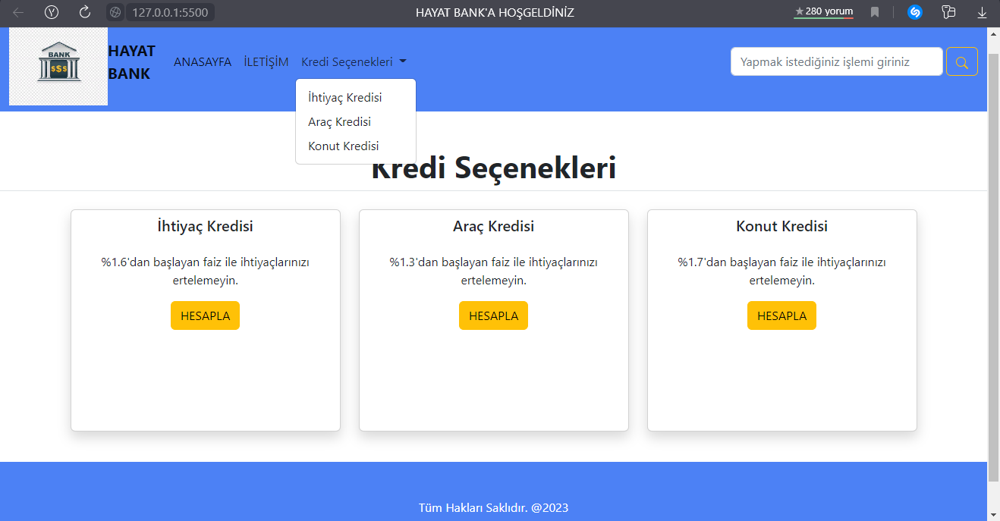

# Bank Website-Interest Calculator
 A site where loan options are examined by going to the created bank's website. After entering the transaction you want to perform and entering the necessary data with<em> `innerHTML` </em> We can see the result in the html page.
   
<video src="./bank.mp4"></video>

  

